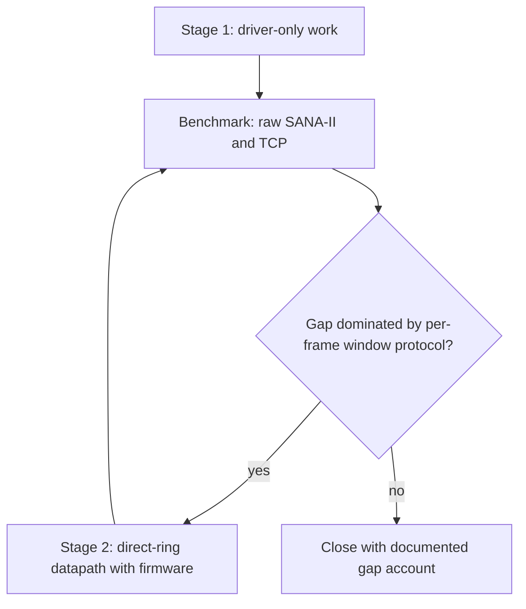
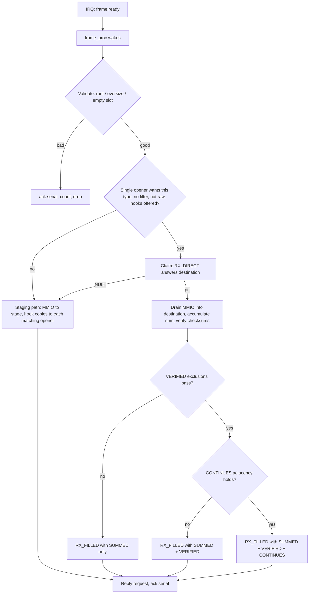
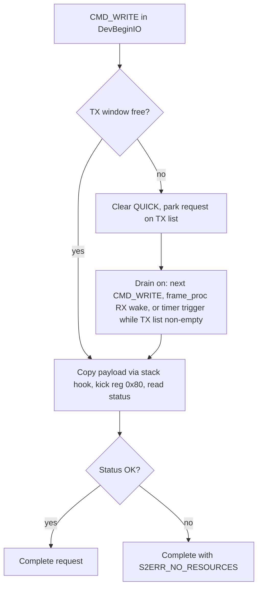

# ZZ9000Net Throughput - Plan

## Goal Capsule

- **Objective:** TCP transfers through `ZZ9000Net.device` on Zorro III ZZ9000 machines run as close to the card's 100 Mbit/s link rate as the platform allows, and a repeatable benchmark shows how close that is and what the remaining gap consists of.
- **Means:** Stage the work. Stage one changes only the Amiga-side driver: unblock transmit, strip diagnostic work from the hot paths, cut the second receive copy, implement AmiNetXDuo's published SANA-II receive-offload extensions, and tune the build — all behind a repeatable two-layer benchmark. Stage two, a ring datapath shared with the ARM firmware, starts only if stage-one measurements show the per-frame window protocol is the remaining limit.
- **Product authority:** The driver maintainer, who set the target machine (68060 A4000, Zorro III), the stack context (AmiNetXDuo), and the staging in dialogue on 2026-09-20.
- **Open blockers:** none. Remaining questions are classified in the Product Contract.
- **Product Contract preservation:** changed: added R10 (extension commands in the same published-extension family R6 names) — flagged for maintainer review at PR time; all other sections unchanged.

---

## Product Contract

### Summary

A staged throughput push on `ZZ9000Net.device` toward the 100 Mbit/s line rate, measured on a 68060 A4000 at both the raw SANA-II layer and the TCP layer. Stage one changes only the Amiga-side driver. Stage two, a ring datapath co-designed with the firmware, is triggered by measurement rather than scheduled.

### Problem Frame

An AmiSpeedTest run on the maintainer's 68060 A4000 with AmiNetXDuo tops out around 8 Mbit/s — one-thirteenth of the link rate the device advertises (`net/device.c:722-723` reports MTU 1500, 100 Mbit/s). Throughput scales with CPU class rather than bus capability: the AmiNetXDuo author measured 3.6 Mbit/s in and 3.5-3.7 Mbit/s out with this driver on a 68030/25 A3000, the same as an X-Surf 100 in the same machine. Per-frame CPU cost, not the Zorro III bus, is the dominant limit today.

The driver spends that CPU on work a modern NIC path avoids. Transmit runs synchronously inside `DevBeginIO`: the payload is copied into the FPGA window, the TX engine is kicked, and the caller waits on a status read-back (`net/device.c:670-681`, kick and status at `:1084-1086`). Every non-RAW IPv4 transmit also passes through a byte-wise TCP header parse installed as an issue-#29 diagnostic against a Roadshow retransmit bug (`net/device.c:1063-1080`); the stack in use is AmiNetXDuo, so the Roadshow-era motivation is gone. Each received frame is copied twice — MMIO window to a Fast-RAM staging buffer, then staging buffer to the client through the stack's copy hook (`net/device.c:970-974`) — and each frame costs an interrupt plus a context switch to the worker process. On top of the driver's cost, the stack verifies every frame's checksum and processes segments frame by frame, because the driver offers no verification or coalescing: a search of `net/` finds no checksum code and no extension negotiation.

The measurement primitives already exist. `ZZNetStats` dumps the SANA-II counters and the firmware RX backlog, backpressure, and drop registers, with a MONITOR mode for sampling during a transfer (`net/ZZNetStats/ZZNetStats.c:57-71`). No throughput number appears anywhere in the repository's own documentation, so the benchmark also becomes the first recorded baseline.

### Key Decisions

- **Stage the work: driver-only first, ring datapath only on measured need.** (session-settled: user-directed — chosen over committing to firmware work up front: firmware changes stay out unless they are the only way to a major win.) Governs R8.
- **The success target is line rate or as close as the platform allows, made concrete by measurement.** A fixed gate below 100 Mbit/s was rejected; the deliverable includes a documented account of any remaining gap. (session-settled: user-directed — the maintainer phrased the target as "saturate the link speed, or get as close to saturation as possible".) Governs R1, R2, SC1, SC2.
- **TCP-side per-frame cost is cut from the driver, through AmiNetXDuo's published SANA-II extensions, rather than by changing the stack.** The stack is open source but lives in another repository (tinic/AmiNetXDuo); its GENET driver went from 142 to 900 Mbit/s with the same extensions. (session-settled: user-approved — proposed with the tradeoff after the maintainer named AmiNetXDuo as the stack in use and ruled out Roadshow as closed source with a known bug.) Governs R6.
- **The issue-#29 ACK-probe parse retires from the transmit hot path.** Its motivation was a Roadshow retransmit bug and the stack in use is AmiNetXDuo. (session-settled: user-approved — call-out confirmed at the scope checkpoint.) Governs R4.

### Actors

- A1. The driver maintainer — runs the benchmark, decides the stage-two trigger.
- A2. AmiNetXDuo — the TCP/IP stack in use; supplies the buffer-management copy hooks and negotiates the SANA-II extensions. System actor, external repository.
- A3. ZZ9000 ARM firmware — serves the FPGA RX/TX windows and the serial-acknowledge protocol; stage-two co-design partner. System actor, external repository.
- A4. Users on other configurations — Zorro II machines, 68020-class CPUs, and other SANA-II stacks (Roadshow, AmiTCP, Miami); compatibility holds for them.

### Key Flows

- F1. Frame received with extensions negotiated
  - **Trigger:** AmiNetXDuo opens the device and accepts the extension tags.
  - **Actors:** A2
  - **Steps:** the interrupt wakes the worker; the frame is validated and a destination claimed from the opener; the MMIO window is drained directly into that destination while a ones-complement sum accumulates; the driver verifies checksums and marks continuation; the opener's fill hook runs and the request is replied.
  - **Outcome:** the stack skips its own checksum pass and processes fewer, larger segments.
  - **Covered by:** R5, R6
- F2. Transmit without blocking
  - **Trigger:** the stack issues CMD_WRITE.
  - **Actors:** A2
  - **Steps:** the payload is copied into the TX window when one is free, or the request is parked; the request completes per SANA-II semantics without waiting on the TX engine's status; a failure surfaces through the request's error fields.
  - **Outcome:** the stack is free to prepare the next frame while the engine transmits.
  - **Covered by:** R3, R4
- F3. Stage-two escalation gate
  - **Trigger:** stage-one benchmark results exist.
  - **Actors:** A1
  - **Steps:** compare the raw SANA-II ceiling against TCP throughput and the firmware counters; if the remaining gap attributes to the per-frame serial-acknowledge protocol, open stage two; otherwise close with the gap account.
  - **Outcome:** firmware work happens only on evidence.

- F4. Batched-read submission and capacity poll
  - **Trigger:** the opener sends `ANXD_CMD_READ_BATCH`, `ANXD_CMD_RX_POLL`, or `ANXD_CMD_RX_CAPACITY`.
  - **Actors:** A2
  - **Steps:** batched reads splice onto the opener lists under the read semaphore with interrupts masked around the list operations only; the poll and capacity commands are answered per the single-window hardware's honest results.
  - **Outcome:** the opener pays one `BeginIO` for a burst of reads and learns what the card cannot hold.
  - **Covered by:** R10

### Requirements

**Measurement**

- R1. A repeatable benchmark measures this driver at two layers on the target machine — raw SANA-II frame throughput and TCP throughput, receive and transmit reported separately in Mbit/s — with run-to-run numbers stable enough to compare before and after a change.
- R2. A benchmark run records the existing ZZNetStats counters, including the firmware RX backlog and drop registers, so a throughput number can be attributed to the driver, the firmware, or frame loss.

**Stage one — Amiga-side driver only**

- R3. CMD_WRITE completes without waiting on the TX engine's status read-back, while SANA-II completion and error semantics for the write request are preserved.
- R4. The transmit hot path performs no diagnostic header parsing in the default build; the issue-#29 ACK-probe path is removed or compiled out.
- R5. A received frame's payload reaches the client buffer through the fewest copies the client's buffer and copy hook permit, with the staged Fast-RAM path retained as a fallback.
- R6. The driver implements AmiNetXDuo's published SANA-II extensions for driver-verified checksum results and TCP continuation (GRO) marking, negotiated through the published tags so a stack that does not negotiate them sees unchanged behavior.
- R7. The shipped driver binary is built with the optimization settings the benchmark shows to be fastest on 68040/68060 while remaining 68020-compatible.

**Stage two — conditional escalation**

- R8. A batched ring datapath using the reserved gen-2 direct-ring aperture carve, co-designed with the ARM firmware and retaining the legacy window protocol as fallback for older firmware, is built only on the F3 gate: stage-one measurement attributing the remaining gap to the per-frame serial-acknowledge protocol.

**Extension commands**

- R10. The driver answers AmiNetXDuo's batch and capacity commands in the same negotiated family as R6: batched reads queue as if sent individually, the poll command answers not-supported, and the capacity command answers the honest 0-or-backlog result the single-frame window's pause behavior dictates. *(Added at planning: same mechanism family as R6, flagged for maintainer review.)*

**Compatibility**

- R9. Existing users keep working: non-negotiating stacks keep today's behavior per R6, Zorro II and 68020-class machines remain functional, and throughput on them does not regress.

### Acceptance Examples

- AE1. Stack without extension support
  - **Covers R6, R9.** AmiTCP or Roadshow opens the device; no extension tags arrive; the driver runs the unchanged receive path; behavior and throughput match the pre-change driver.
- AE2. Stack with extension support
  - **Covers R6.** AmiNetXDuo opens the device and negotiates; a received IPv4 frame carries a verified checksum result and continuation marking; the TCP benchmark improves against the same transfer without the extensions.
- AE3. Failing transmit
  - **Covers R3.** The TX engine reports an error; the write request still completes with the error surfaced in its status fields; the stack learns of the failure.
- AE4. Machine without Fast RAM staging
  - **Covers R5.** The staging allocation fails; the driver falls back to direct MMIO delivery and keeps receiving frames.
- AE5. Batch and unsupported commands
  - **Covers R10.** An opener sends batched reads and they complete in list order as if sent one by one; the poll command is answered not-supported and the opener stops sending it; neither answer disturbs reception.

### Scope Boundaries

- Zorro II-specific tuning passes are deferred; R9 requires no regression there, but dedicated Z2 optimization is not this work.
- Changes inside the AmiNetXDuo repository, including any retransmit-bug archaeology there, stay out; this work consumes its published SANA-II extensions only.
- MTU and jumbo-frame work stays out; the hardware receive window caps frames at 1518 bytes.
- Other ZZ9000 subsystems (graphics, USB, audio, SD boot) stay out.

#### Deferred to Follow-Up Work

- R8's stage-two ring datapath: gated on F3 (KTD10 defines the threshold). The in-repo precedent for the direct-ring carve is the AHI driver (`ahi/driver/zz9000ax-ahi.c:1138`, `:1448`); the firmware side builds ARM-only in the `BlitterStudio/zz9000-firmware` fork (v2.8.0-rc3 base, `./build_firmware.sh`, no Vivado) and flashes with this repo's `ZZFwUpdate`. A separate plan owns it once the gate passes.
- TX checksum offload (`ANXD_S2_TX_CSUM`): published in the same header and deliberately out of this stage — the driver does not own TX bytes today, so honoring it adds a TX staging pass. Revisit after F3 with measurements in hand.

### Success Criteria

- SC1. On the 68060 A4000, sustained TCP throughput improves by a large multiple of the 8 Mbit/s AmiSpeedTest baseline, with the raw SANA-II layer showing the driver's own ceiling.
- SC2. The final report states the measured ceiling and attributes any remaining gap (driver, firmware, stack, or bus), making "as close to saturation as possible" concrete.

### Dependencies / Assumptions

- Assumption: the AmiNetXDuo installation on the target machine supports the published extensions (`include/aminetxduo/anxs2ext.h` in that repository); the vendored header is copied verbatim from a pinned upstream commit whose hash is recorded in the provenance note, and U7's matrix records the installed stack and firmware versions so silent non-negotiation is detectable.
- Dependency: a peer machine that sources line-rate traffic and counts received frames — the TX validity gate and the RX offered-load check both read its interface statistics (KTD8); no FPGA ethernet TX counter exists.
- Dependency: the extension API and the GENET precedent live in the external tinic/AmiNetXDuo repository; this repository consumes them and does not modify them.
- Assumption: the 8 Mbit/s figure is a TCP-layer measurement; the raw SANA-II baseline is unknown until R1 exists.

### Outstanding Questions

- OQ1. (Deferred to Implementation) Reg 0x80's read-back semantics after a kick — accepted, in-progress, done — are undocumented; characterize on hardware during U3 before choosing the free-window detection.
- OQ2. (Deferred to Implementation) The firmware RX backlog depth in bytes and whether the firmware pauses the wire under pressure — U2's saturation blast with `ZZNetStats` MONITOR observes both and feeds KTD6's capacity answer.
- OQ3. (Deferred to Implementation) Whether `-O3`/`-mlra` beats `-O2` on 68040/68060 for this hot path; U7's A/B matrix decides.

### Sources / Research

- `net/device.c` — verified hot paths: synchronous TX (`:670-681`, kick and status `:1084-1086`), issue-#29 parse (function `:126`, call `:1063-1080`), RX double copy (rationale `:157-178`, fast path `:970-974`), serial-acknowledge protocol (header read `:831-834`, loop `:1124-1126`, acknowledge `:1268`), device query MTU/BPS (`:722-723`), client-supplied copy hooks (`:379-381`); lifecycle: CMD_READ queueing (`:644-660`), DevAbortIO (`:769-795`), frame_proc creation and handshake (`:424-443`, `:1110-1118`), last-close teardown (`:569-582`), read-list matching (`:1231-1238`), first-open counter reset (`:407-412`).
- `include/zz9000_aperture.h:55-60` — gen-2 direct-ring carve (`ZZ_Z2_DIRECT_RING_RESERVE_SIZE 0x0000C000`), unused by `net/`; the in-repo precedent consumer is the AHI driver (`ahi/driver/zz9000ax-ahi.c:1138`, `:1448`).
- `include/zz9000_hw.h:46-52` — Ethernet register map: TX kick 0x80, RX accept 0x82, RX status 0x8C, RX stats 0x8E.
- `net/Makefile:13,16,18-35` — one-gcc-call device build (`-m68020 -O2 -nostdlib`, SOURCES and header prerequisite line), version stamping from `net/version.h` (`DEVICEVERSION 2`, `DEVICEREVISION 2`).
- `net/ZZNetStats/ZZNetStats.c` — OpenDevice + S2_GETGLOBALSTATS/S2_GETSPECIALSTATS skeleton, MONITOR loop (`:155-220`), firmware register dump (`:57-71`); the benchmark tool follows this shape.
- `tools/build-all.sh:56-60,75` — docker build orchestration for net + ZZNetStats; host tests run via `make -C rtg/tests test`.
- `rtg/tests/Makefile`, `common/tests/stubs/` — host-side C test convention (plain `cc`, stub `exec/types.h` and `zz9000_hw.h`) the new net tests follow.
- tinic/AmiNetXDuo (GitHub) — `include/aminetxduo/anxs2ext.h`: the extension contract (tags 0x4181-0x4185, commands 0x4190-0x4192, VERIFIED exclusions, CONTINUES conditions, hook signatures, pointer-return negotiation). `src/netdev/netdev_direct.c`: reference device-side claim/complete (decline rules, raw refusal, link-header write, batched per-port replies). `src/net68k/n68k_iocopy.c`: the published sum semantics (`n68k_port_in_l_sum`). README "Measured on" table: this driver at 3.6 in / 3.5-3.7 out Mbit/s on A3000/68030, comparable to X-Surf 100; GENET 142 → 900 Mbit/s with the extensions.
- Maintainer-reported: AmiSpeedTest approximately 8 Mbit/s maximum, 68060 A4000, AmiNetXDuo.

---

## Planning Contract

### Key Technical Decisions

- KTD1. **Implement the published `anxs2ext.h` receive extensions verbatim, vendoring the header into `net/`.** The MIT-licensed header is copied unchanged from a pinned upstream commit (hash recorded in the provenance note and in U7's matrix) so the build never depends on an external checkout; behavior follows its published semantics, with `src/netdev/netdev_direct.c` in the AmiNetXDuo repository as the reference device-side implementation. (session-settled: user-approved — instantiates the Key Decision governing R6: extensions over stack changes, chosen after the maintainer named AmiNetXDuo and ruled out Roadshow.) Governs R5, R6, R10.
- KTD2. **Introduce per-opener records and adopt the reference delivery semantics.** Reads move to per-opener lists; a frame type matched by several openers is delivered to each (staging duplicates); the direct claim declines when more than one opener wants the type, when the request is raw, or when the opener installed a packet filter. Today's single shared list delivers to the first match only (`net/device.c:1231-1238`), which starves a second opener — the benchmark tool would steal the stack's frames. Wire-level counters (`PacketsReceived`, `UnknownTypes`) increment once per wire frame regardless of delivery count, so R2 attribution stays frames-not-deliveries. Governs R5, R6, R9.
- KTD3. **Async TX is a pending queue with a guaranteed drain trigger, not just an opportunistic one.** `DevBeginIO` attempts a drain on every entry, then either sends inline or parks the request; `frame_proc` polls TX status on every RX wake; and while the TX list is non-empty a one-shot timer.device wake (or VBLANK server) re-checks the window — without that third trigger, a reply-pacing stack or a silent peer (UDP query) deadlocks on the final parked write, since no TX-done interrupt exists. One TX critical section — a semaphore held from the window-free check through the copy, kick, and status read in every context — serializes the inline-send path and every drain path, because the posting task and `frame_proc` can otherwise interleave two payloads into the single FPGA window. The kick/read-back result reaches the parked request's error fields, preserving today's `S2ERR_NO_RESOURCES` failure path. Governs R3.
- KTD4. **The direct RX drain is one MMIO pass that also accumulates the published sum.** Order is unlink, validate, claim, drain: the request leaves its opener list under `db_ReadListSem` before `RX_DIRECT` is invoked (a still-linked request could be aborted and double-replied mid-claim — the reference unlinks first); frame checks (runt, oversize, empty slot, per-opener size policy) run before the claim so a claimed request is always filled exactly once; a NULL claim answer re-queues the request at the head and takes the staging path. From unlink to reply the request is invisible to `DevAbortIO` (not-abortable, per KTD11). The drain loop accumulates the ones-complement sum with end-around carry over big-endian longwords, zero-padded tail — `n68k_port_in_l_sum` semantics — at copy cost. Governs R5.
- KTD5. **VERIFIED and CONTINUES are computed in the driver during the drain, with the published exclusion and suppression rules.** VERIFIED never set on padding past the IP total length, IP options, fragments, or a zero UDP checksum; the IP header and pseudo-header sums come from the header words the drain already touches. CONTINUES is decided against the *previous frame delivered to that opener* — one record per opener, not a per-flow table, cleared by any delivery that is not the continuation, by any serial gap or overrun, by a bad frame, or by an offline-online transition; the serial-gap detector at `net/device.c:1194-1225` provides the gap signal. Peers negotiating TCP timestamps or window scaling never qualify (published rule), so the GRO half can be inert on modern transfers — U7's verification records which half delivered the improvement. Governs R6.
- KTD6. **The extension commands answer honestly for single-window hardware: batch yes, hold no.** `ANXD_CMD_READ_BATCH` takes the read semaphore at task level first, then masks interrupts around the pure list-splice only (no semaphore call inside `Disable()` — a contested `ObtainSemaphore` waits, and waiting inside `Disable()` hangs Exec); `ANXD_CMD_RX_POLL` answers `S2ERR_NOT_SUPPORTED` — withholding the serial acknowledge would stall all reception while the firmware backlog fills; `ANXD_CMD_RX_CAPACITY` answers 0 only after U2's saturation blast shows the firmware actually pauses the wire (`FirmwareRXPauseSent` moving); if drops accumulate without pause, U6 answers the measured backlog bytes instead. Governs R10.
- KTD7. **The driver's hooks run in the caller-of-record's task context, not interrupt level.** The RX extension hooks run from `frame_proc` at task level; the TX buffer-management copy hook runs in whichever context drains the window (the posting task or `frame_proc`). The published RX contract promises interrupt level — task level is a weaker, safe guarantee for hook code that tolerates interrupt context — and it keeps `db_ReadListSem` legal. Both deviations rely on the standing SANA-II rule that a request and its buffers stay untouched until replied. Documented in the vendored header's companion note. Governs R3, R5, R6.
- KTD8. **The benchmark is a new Amiga-native tool, `ZZNetBench`, plus a documented TCP procedure.** The tool follows ZZNetStats' skeleton (OpenDevice, S2_ONLINE on open, counter snapshot before/after, RAW-mode reads and writes, timer.device timing) and reports RX/TX Mbit/s. Because the direct path refuses raw requests, the tool's RX modes are two: a raw mode that measures the staging fallback path, and a negotiated-hook mode that offers the extension pair itself and measures the direct drain — the F3 gate's raw ceiling is the negotiated-hook number when negotiation succeeds, with the raw number as the fallback-path reference. An RX run counts only when the Overrun delta is ~0 and a sender-side rate is recorded beside it (peer interface statistics), so a sender-limited run is never read as a driver ceiling; TX numbers are reportable only beside a matching receiver-side count from a peer machine — the FPGA register map exposes no ethernet TX counters (`include/zz9000_hw.h:46-52` lists RX status 0x8C and RX stats 0x8E only). The raw layer deliberately posts plain `CMD_READ`s, not `READ_BATCH`, so it measures the driver ceiling, not the stack's batched path. The TCP layer uses the maintainer's AmiSpeedTest under the same procedure, including one run against a peer configured with TCP timestamps and window scaling disabled so the CONTINUES half is actually exercised. Governs R1, R2.
- KTD9. **One 68020-compatible binary; optimization flags chosen by measured A/B.** Candidate sets (`-O2` baseline, `-O3`, `-mlra` additions, `-mtune=68060`) are built and measured on the target before shipping; `net/version.h` revision bumps with the change. The `.68000` filename reference in `tools/check-release.sh` is treated as stale tooling residue, not a variant to produce. Governs R7.
- KTD10. **The F3 escalation threshold: raw receive sits materially below the bus-implied ceiling with near-zero drops after stage one.** Budget yardstick at line rate (~8,230 frames/s at MTU, ~122 µs per frame on the wire): post-stage-one fixed overhead is roughly 15-30 µs per frame, and a 1518-byte MMIO drain costs ~110-215 µs at a plausible 7-14 MB/s effective Zorro III read bandwidth — so stage one's raw ceiling is expected at 45-70 Mbit/s and the drain, not the protocol, is the likely residual limiter. U2 measures the machine's actual MMIO read/write bandwidth once (bulk read of the live RX window; blast through the TX path) and records it beside every matrix row. The gate's raw ceiling is the negotiated-hook number (KTD8) — the staging-path raw number pays a second copy the yardstick omits and would open the gate by construction. Stage two opens only when that direct-path ceiling stalls below the bus-bandwidth-implied ceiling while firmware drops stay near zero — a protocol-bound stall — not merely below 40 Mbit/s; full-duplex TCP necessarily sits below the one-way raw ceiling because reverse ACKs contend for the same bus, and the gap account states that term. Governs R8.
- KTD11. **Opener and shutdown lifecycle rules for the new state.** Any close — not only the last — scans the read and TX lists under their locks and aborts that opener's still-queued reads and parked writes (`IOERR_ABORTED`), because the drainer would otherwise call the freed opener's copy hooks (use-after-free). A request being drained or claimed is off-list and pins its opener record: the record's free is deferred until the drain replies, and `DevAbortIO` returns not-abortable for it, mirroring the existing RX rule; the read walk in `DevAbortIO` visits every opener's list, not one shared list. Last close additionally drains or reply-aborts all pending TX before joining `frame_proc`. Governs R3, R5, R9.

### High-Level Technical Design

The receive path after stage one, with its decline fallbacks:

The transmit path:

### Assumptions

- Per-opener delivery duplication (KTD2) is a correction toward the SANA-II opener model, not a behavior regression; the current first-match-only delivery was never SANA-II-conformant for multi-open tracking.
- The `is_online` flag stays unenforced for reads and writes, as today; enforcing `S2ERR_OUTOFSERVICE` is a behavior change no stage-one requirement asks for, and the benchmark tool brings the unit online itself.
- Reg 0x80's read-back is fast and non-blocking (today's code treats it as an accept check); if hardware characterization in U3 shows it can block, the drain keeps KTD3's timer trigger and drops only the RX-wake poll, never falling back to drain-on-write alone — that would reintroduce the reply-pacing deadlock.
- `ANXD_S2_RX_LINK_HDR` is accepted only when the opener offered the direct pair and the read is cooked; raw requests always take the staging path.

### Constraints

- All driver code stays 68020-compatible C built by the single-gcc-call `net/Makefile` flow; no new toolchain assumptions.
- The vendored extension header stays byte-identical to its upstream source, SPDX header included, so drift is auditable.
- Host tests must not require Amiga hardware; anything needing the card is an on-hardware procedure step owned by the maintainer.

---

## Implementation Units

### U1. Per-opener records and extension negotiation

- **Goal:** Every opener gets a record carrying its hooks, negotiated flags, filter, and read list; the extension tags are parsed, vendored, and answered per the published pointer-return protocol.
- **Requirements:** R6, R10, R9 (non-negotiating openers unchanged)
- **Dependencies:** none
- **Files:** `net/device.c`, `net/device.h`, new `net/anxs2ext.h` (vendored verbatim from tinic/AmiNetXDuo `include/aminetxduo/anxs2ext.h`), new `net/anxs2ext.provenance.md`, new `net/tests/` (Makefile + tests), `tools/build-all.sh`
- **Approach:**
  1. Vendor the header byte-identical; record the pinned upstream commit hash in a companion note beside it (`net/anxs2ext.provenance.md`), which also carries KTD7's hook-context deviation documentation.
  2. Add the opener record to `DevOpen` (replace the bare `ios2_BufferManagement` allocation), link it into a device-wide opener list, extract `S2_PacketFilter` alongside the copy hooks, parse `ANXD_S2_RX_DIRECT`/`RX_FILLED`/`RX_LINK_HDR`/`RX_FLAGS` as a strict pair set, and write the accepted intersection back through the tag pointers.
  3. Move reads to per-opener lists behind the existing `db_ReadListSem`; keep the abort path working per list.
  4. Free the record only after aborting that opener's queued reads in `DevClose` (KTD11); parked writes join this scan when U3 adds the TX list; a request being drained pins the record, deferring the free until its reply.
  5. Wire `make -C net/tests test` into `tools/build-all.sh` beside the existing `make -C rtg/tests test` line.
- **Execution note:** Keep the claim/negotiation logic in separately compilable functions so host tests can exercise it — the pattern `netdev_direct.c` was split out for.
- **Test scenarios** (`net/tests/claim_test.c`):
  - Pair validation: an opener offering `RX_FILLED` without `RX_DIRECT` gets no extensions and staging; both together enable the direct path.
  - `RX_LINK_HDR` without the pair is ignored; with the pair the BOOL is set TRUE.
  - `RX_FLAGS` preloaded `VERIFIED|CONTINUES` comes back as the intersection; preloaded 0 asks for everything the device supports.
  - Two openers reading the same type: claim declines, both get staging copies.
  - An opener with a packet filter: claim declines for it.
  - Raw request on the direct path: re-queued, staging used.
  - Non-negotiating opener: no tag answers written, behavior identical to today (Covers AE1).
- **Verification:** Host tests pass under `make -C net/tests test`; docker build of the device succeeds; a Roadshow-era stack shows no negotiation side effects on hardware.

### U2. ZZNetBench benchmark tool

- **Goal:** A repeatable raw SANA-II throughput measurement with counter attribution and its own validity gates, runnable standalone on the target machine.
- **Requirements:** R1, R2
- **Flows:** measures F1's and F2's raw layer
- **Dependencies:** none (a peer machine that can both source line-rate traffic and count received frames is an environment requirement, recorded in U8's procedure and Dependencies)
- **Files:** new `net/ZZNetBench/ZZNetBench.c`, `tools/build-all.sh` (one build line beside ZZNetStats), `tools/package-local.sh` + `tools/check-release.sh` (artifact entries)
- **Approach:**
  1. Follow the ZZNetStats skeleton: msg port, `IOSana2Req`, `OpenDevice`, `S2_ONLINE` on start, RAW-mode operation.
  2. RX runs in two modes (KTD8): a raw mode posting a caller-chosen depth of `CMD_READ`s with reply-port-driven refill — measuring the staging fallback path — and a negotiated-hook mode that offers the extension pair itself and counts delivered payload bytes — measuring the direct drain. A run counts only when the Overrun delta is ~0 and the peer's sender-side rate is recorded beside it. TX mode: blast `CMD_WRITE`s of a size argument through a bounded in-flight window replenished from replies, so the final parked request completes.
  3. A one-time `BUS` mode measures bulk MMIO read bandwidth (repeated reads of the live RX window) and write bandwidth (the TX window path), recording the machine's bus constants for KTD10's yardstick.
  4. Snapshot `S2_GETGLOBALSTATS` before and after; print deltas including overruns and drops (R2). During the first saturation blast, run `ZZNetStats` MONITOR and record `FirmwareRXPauseSent`, `FirmwareRXDropped`, and backlog state — the pause-vs-overrun observation KTD6 depends on.
  5. Timing via timer.device `UNIT_MICROHZ`, held open for the run.
- **Execution note:** Measurement-first direction: land this before the driver changes so before-numbers exist on the unchanged driver.
- **Test scenarios:**
  - Argument parsing, mode selection, and depth/in-flight bounds (host-compilable portion).
  - Duration run ends on time, not frame count; counter snapshot prints both ends.
  - TX validity: a TX number prints only beside a receiver-side count from the peer or the firmware TX counters (KTD8).
  - On-hardware: raw RX and TX each report a stable number across three consecutive runs under the U8 environment rules.
- **Verification:** Tool builds in docker, runs on hardware, and its output format is machine-diffable (one line per measurement); the BUS constants and the pause/overrun observation are recorded.

### U3. Asynchronous transmit

- **Goal:** CMD_WRITE stops blocking on the engine; the #29 parse leaves the default build; failures still complete their request; parked writes stay abortable and live.
- **Requirements:** R3, R4 (AE3)
- **Flows:** F2
- **Dependencies:** U1 (opener records hold the write path context)
- **Files:** `net/device.c`, `net/device.h`, new `net/tests/tx_test.c`
- **Approach:**
  1. Delete the `zznet_parse_ip_tcp` call and its helper from `write_frame`; the retired #29 TX parse is absent per the Definition of Done, not compiled out.
  2. Add the TX pending list; `DevBeginIO` attempts a drain on every entry, then either sends inline (window free) or parks the request with `SANA2IOF_QUICK` cleared.
  3. One TX critical section serializes every path that touches the window: a semaphore held from the window-free check through the payload copy, kick, and status read, in the posting task and in `frame_proc` alike, so two contexts can never interleave payloads into the single FPGA window; a parked request has exactly one owner from list removal to kick (KTD3).
  4. `frame_proc` polls the window in its RX-wake path; while the TX list is non-empty, a one-shot timer.device wake (or VBLANK server) re-checks the window — the liveness trigger that keeps a reply-pacing stack and silent-peer UDP from deadlocking (KTD3).
  5. Teach `DevAbortIO` the TX list: a parked write is removed and replied `IOERR_ABORTED`; one being copied or kicked is off-list and not abortable, mirroring the RX rule (KTD11).
  6. Kick/read-back status completes the parked request's error fields (AE3).
- **Execution note:** Characterize reg 0x80 read-back on hardware first (OQ1) — the free-window detection depends on it, and U2's TX validity gate consumes the answer. The RX-side inbound #29 probe (`read_frame`'s src-port-445 parse, `net/device.c:981-1002`) is deliberately retained: its counters stay meaningful exactly for the non-negotiating stacks that still carry the Roadshow-era bug, and the negotiated direct path bypasses it de facto.
- **Test scenarios:**
  - Park-then-drain: a parked request completes once the window frees, in order behind earlier parks.
  - Liveness: with no RX traffic and no further writes, the timer trigger drains the last parked request (KTD3).
  - Kick returns error: parked request completes with the write error set (Covers AE3).
  - Abort of a parked write: removed and replied `IOERR_ABORTED`; abort of an in-drain write returns not-abortable (KTD11).
  - Non-last close with parked TX: that opener's parked writes are aborted and replied before its record is freed; other openers keep transmitting (KTD11).
  - Last close with parked TX: all pending writes reply-aborted before frame_proc exits (KTD11).
- **Verification:** Host tests for queue order, liveness, abort, and error propagation; on-hardware TX benchmark improves against U2's baseline with a matching receiver-side count.

### U4. Single-copy direct receive

- **Goal:** Negotiated frames drain MMIO straight into the opener's buffer with the inline sum; every decline path falls back to staging.
- **Requirements:** R5 (AE4 fallback retained)
- **Flows:** F1
- **Dependencies:** U1
- **Files:** `net/device.c`, `net/device.h`, `net/tests/drain_test.c`
- **Approach:**
  1. In `frame_proc`, after validation: unlink the winning request from its opener list under `db_ReadListSem`, then invoke `RX_DIRECT` — the unlink-before-hook order that keeps `DevAbortIO` from double-replying a mid-claim request (KTD4); a NULL answer re-queues at the head and stages.
  2. The drain loop replaces `zznet_mmio_read_block` when a destination is claimed: phase-matched longword MMIO reads into the opener pointer, accumulating the end-around-carry sum; word/byte tails per the published zero-padding.
  3. Write the link header to the 14 bytes before the destination when negotiated; fill `ios2_SrcAddr`/`DstAddr`/`PacketType`/`DataLength`/flags as the reference does.
  4. Call the fill hook from `frame_proc` context (KTD7), then reply and ack the serial.
- **Execution note:** The staging path and `db_RxStage` stay untouched — they remain the fallback for raw, filtered, multi-taker, and no-hook cases (Covers AE4).
- **Test scenarios:**
  - Sum vector: a known buffer drains to a sum identical to the reference `n68k_port_in_l_sum` output, including 1-, 2-, and 3-byte tails.
  - Claim-then-error ordering: an oversize or runt frame never reaches the claim.
  - NULL claim: request re-queued at the head, staging path used, request replied once.
  - Staging unavailable: with the staging buffer NULL, a decline-path frame delivers via the direct MMIO copy source and the request is replied once (Covers AE4).
- **Verification:** Host tests pass; on-hardware negotiated-hook RX benchmark improves (KTD8); ZZNetStats shows no new drops.

### U5. Verified checksums and continuation marking

- **Goal:** The driver certifies IPv4/TCP/UDP checksums during the drain and marks GRO continuation where adjacency holds.
- **Requirements:** R6 (AE2)
- **Flows:** F1
- **Dependencies:** U4
- **Files:** `net/device.c`, `net/device.h`, `net/tests/verify_test.c`
- **Approach:**
  1. From the drain's header words, verify the IPv4 header checksum and the TCP/UDP checksum with the pseudo-header sum; set `VERIFIED` only when the published exclusions all pass (KTD5).
  2. Keep one previous-delivered record per opener — not a per-flow table — and compute `CONTINUES` against it (same addresses and ports, sequence continuity, same ACK/window/flags ACK or ACK+PSH, no TCP options, both VERIFIED); any delivery that is not the continuation replaces the record (KTD5).
  3. Clear the record on serial gap, overrun, bad frame, or offline-online transition.
  4. Answer `ANXD_S2_RX_FLAGS` with the accepted intersection at open (from U1).
- **Test scenarios:**
  - Checksum vectors: valid TCP and UDP frames verify; a corrupted payload does not; an IP-options frame, a fragment, a padded-past-total-length frame, and a zero-checksum UDP frame never set VERIFIED.
  - Continuation: two back-to-back segments of one stream chain; a retransmit, a window change, a flags change, or an intervening gap does not.
  - Interleaved flows: a frame of another stream delivered between two continuations breaks the chain — no CONTINUES on the second (KTD5).
  - State reset: a simulated overrun suppresses CONTINUES on the next frame (Covers AE2's negative space).
- **Verification:** Host tests pass; on-hardware TCP benchmark improves with AmiNetXDuo and is unchanged with a non-negotiating stack; the run records a positive negotiation observable (stack log line) and whether the test peer's segments carried TCP options, so the matrix says which extension half paid.

### U6. Extension commands

- **Goal:** `READ_BATCH`, `RX_POLL`, and `RX_CAPACITY` answer per KTD6.
- **Requirements:** R10 (AE5)
- **Flows:** F4
- **Dependencies:** U1, U2 (the pause/overrun observation decides the capacity answer)
- **Files:** `net/device.c`, `net/device.h`, new `net/tests/dispatch_test.c`
- **Approach:**
  1. Add the three command cases to the `DevBeginIO` switch.
  2. `READ_BATCH`: take `db_ReadListSem` at task level first, then mask interrupts around the pure list-splice only — no semaphore call inside `Disable()` — performing each request's queueing work exactly as its own CMD_READ would (KTD6).
  3. `RX_POLL`: reply `S2ERR_NOT_SUPPORTED`; `RX_CAPACITY`: answer 0 when U2's blast showed the firmware pausing the wire, or the measured backlog bytes when drops accumulated without pause (KTD6).
- **Test scenarios:**
  - Batched reads complete in list order and each reaches the correct opener list.
  - An unknown command still answers `S2ERR_NOT_SUPPORTED` as today (`net/device.c:756-759`); the three new ones answer success or not-supported exactly per KTD6 (Covers AE5).
- **Verification:** Host dispatch tests pass; AmiNetXDuo logs show it stops sending `RX_POLL` after the first answer.

### U7. Build tuning and the measurement matrix

- **Goal:** The shipped binary carries the measured-best flags, and the before/after record exists.
- **Requirements:** R7, SC1, SC2
- **Flows:** F3 (gate verdict)
- **Dependencies:** U2, U3, U4, U5, U6
- **Files:** `net/Makefile`, `net/version.h`
- **Approach:**
  1. Build the candidate flag sets (KTD9), measure each with ZZNetBench and AmiSpeedTest on the target, keep the winner in the Makefile.
  2. Record the full before/after matrix (raw RX in both KTD8 modes, raw TX, TCP) and the gap attribution against SC2; every row records the environment conditions (U8), the measured MMIO bus constants, the installed AmiNetXDuo and firmware versions, and the vendored-header pinned-commit hash (KTD1); at least one TCP run uses a peer with TCP timestamps and window scaling disabled (KTD5); evaluate the F3 gate per KTD10 and record the verdict.
  3. Bump `DEVICEREVISION`.
- **Test scenarios:**
  - Every candidate flag set builds in docker.
  - The recorded matrix shows the chosen flags beating the baseline on the target (or the baseline is kept with the measurement saying so).
- **Verification:** Matrix recorded in the PR body; chosen flags in `net/Makefile`; revision bumped.

### U8. Packaging, release tooling, and documentation

- **Goal:** Everything ships: the tool is packaged, release checks pass, and the procedure plus numbers are documented.
- **Requirements:** R1 (procedure half), SC2 (published account)
- **Dependencies:** U2, U7
- **Files:** `tools/package-local.sh`, `tools/check-release.sh`, `README.md`, `net/ZZNetBench/` (version string)
- **Approach:**
  1. Stage ZZNetBench into the installer Tools beside ZZNetStats; add its release-presence check.
  2. README: a Networking-performance section with the ZZNetBench + AmiSpeedTest procedure, the counter-interpretation note, the environment rules — screen blanked or a fixed low-depth mode (the ZZ9000's own RTG refresh shares the Zorro III bus with every measurement), stack stopped, quiet machine, one discarded warm-up run, median of at least three with spread — and the measured table (or an explicit pointer to the PR body where U7's matrix lives).
  3. Confirm no generated binary is git-tracked.
- **Test scenarios:**
  - `tools/check-release.sh` full mode passes with the new artifact.
  - The README procedure, followed on a second machine, reproduces a measurement.
- **Verification:** Release check green; package contains the tool; documentation matches the shipped behavior.

---

## Verification Contract

- **Build:** `tools/build-all.sh` in the amiga-gcc docker image — the net device, ZZNetStats, and ZZNetBench all compile; every U7 candidate flag set compiles.
- **Compatibility (R9):** the `-m68020` docker build stays green for every unit (the shared-path changes are architecture-neutral by construction); a review note records that per-opener records, async TX, and negotiated RX change no Zorro-II-specific code path; on-hardware Zorro II or 68020-class numbers are recorded in U7's matrix if such a machine is available, and their absence is stated rather than implied.
- **On-hardware procedure (maintainer, A4000/060):** ZZNetBench raw RX/TX before and after, TX numbers beside receiver-side counts (KTD8); AmiSpeedTest TCP before and after; `ZZNetStats` MONITOR deltas during runs; environment held to U8's rules (blanked or fixed-mode screen, stack stopped, quiet machine, warm-up discarded, median of at least three); results recorded per U7's matrix with bus constants and stack/firmware versions. CI cannot exercise the card.

## Definition of Done

- All units U1-U8 merged; docker build and host tests green; release check green with ZZNetBench packaged.
- The U7 measurement matrix exists with before/after numbers and the F3 gate verdict recorded (SC2), or the PR states explicitly that hardware measurement is pending and owned by the maintainer.
- No dead experimental code in the diff: abandoned flag sets, diagnostic scaffolding, and the retired #29 parse are absent, not commented out.
- `net/version.h` revision bumped; README procedure section present.
- Stage-two remains unstarted unless the F3 verdict says otherwise; its follow-up plan references this artifact.
